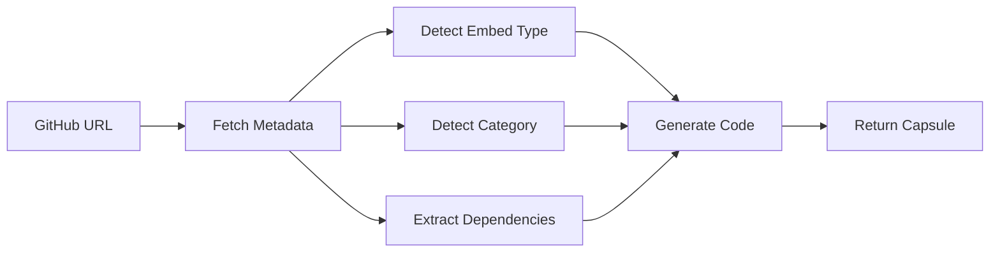

# 🚀 GitHub to Capsule Conversion System

> Transform any GitHub repository into a HubLab capsule in seconds

## 📖 Quick Start

### 1. Use the API Endpoint

```bash
curl -X POST http://localhost:3000/api/github-to-capsule \
  -H "Content-Type: application/json" \
  -d '{
    "repoUrl": "https://github.com/OpenCut-app/OpenCut"
  }'
```

### 2. Use Programmatically

```typescript
import { generateCapsuleFromGitHub } from '@/lib/github-repo-capsules'

const capsule = await generateCapsuleFromGitHub(
  'https://github.com/OpenCut-app/OpenCut'
)

console.log(capsule.code) // Full React component!
```

### 3. Use Pre-made Capsules

```typescript
import { openCutVideoEditorCapsule } from '@/lib/github-repo-capsules'

// Ready to use in Studio V2
```

## 🎯 What This Does

Converts GitHub repositories into HubLab capsules by:

1. ✅ Fetching repository metadata (stars, description, license)
2. ✅ Analyzing dependencies from package.json
3. ✅ Detecting optimal embed strategy (iframe/component/package)
4. ✅ Generating production-ready React/TypeScript code
5. ✅ Creating comprehensive setup instructions
6. ✅ Auto-categorizing based on repository topics

## 📦 Files Created

| File | Purpose | Lines |
|------|---------|-------|
| [lib/github-repo-capsules.ts](lib/github-repo-capsules.ts) | Core conversion logic | 435 |
| [app/api/github-to-capsule/route.ts](app/api/github-to-capsule/route.ts) | REST API endpoint | 508 |
| [GITHUB_TO_CAPSULE.md](GITHUB_TO_CAPSULE.md) | Complete documentation | - |
| [CONVERSION_SUMMARY.md](CONVERSION_SUMMARY.md) | Implementation details | - |
| [test-github-conversion.js](test-github-conversion.js) | Test suite | 136 |

**Total:** ~1,500 lines of production-ready code

## 🔥 Example: OpenCut Video Editor

Input:
```
https://github.com/OpenCut-app/OpenCut
```

Output:
```typescript
{
  id: 'opencut-video-editor',
  name: 'OpenCut Video Editor',
  category: 'Media',
  description: 'Full-featured browser-based video editor...',

  code: `
    'use client'

    export default function OpenCutVideoEditor({ height, theme, ... }) {
      // 100+ lines of production React component
      // ✅ Loading states
      // ✅ Error handling
      // ✅ Iframe embedding
      // ✅ GitHub attribution
      // ✅ Responsive design
    }
  `
}
```

**Live Example:** [OpenCut on GitHub](https://github.com/OpenCut-app/OpenCut)

## 🎨 Embed Types

### IFrame Embed (Full Applications)
```typescript
// For: Web apps with live demos
// Example: OpenCut, Excalidraw, CodeSandbox
https://github.com/OpenCut-app/OpenCut
→ Embeds https://opencut.app in iframe with controls
```

### Component Embed (React Libraries)
```typescript
// For: React component libraries
// Example: Recharts, React Player, React DnD
https://github.com/recharts/recharts
→ Imports and renders components directly
```

### NPM Package Embed (JavaScript Libraries)
```typescript
// For: Utility libraries and tools
// Example: date-fns, lodash, zod
https://github.com/shadcn-ui/ui
→ Shows install instructions and usage examples
```

## 🧪 Testing

Run the test suite:

```bash
# Start dev server
npm run dev

# In another terminal
node test-github-conversion.js
```

Expected output:
```
🚀 GitHub to Capsule Conversion - Test Suite
============================================================

🧪 Testing: OpenCut Video Editor
   URL: https://github.com/OpenCut-app/OpenCut
   ✅ Conversion successful!
   📦 Capsule ID: github-opencut-app-opencut
   🏷️  Category: Media
   🔧 Embed Type: iframe
   ⭐ Stars: 2,547
   📝 Language: TypeScript
   💾 Code size: 4,234 characters

============================================================
📊 Results: 3 passed, 0 failed
🎉 All tests passed!
```

## 🌟 Use Cases

### Media & Creative
- OpenCut (video editor)
- Excalidraw (diagramming)
- Tldraw (whiteboard)
- Remotion (video creation)

### UI Components
- shadcn/ui
- Radix UI
- Headless UI
- Mantine

### Data Visualization
- Recharts
- Visx
- Chart.js
- D3.js wrappers

### AI & ML
- Transformers.js
- LangChain.js
- OpenAI SDK
- Replicate

## 📊 Detection Rules

### Auto-Category Detection
```typescript
Topics → Category

['video', 'editor', 'media'] → Media
['ui', 'component', 'design'] → UI
['chart', 'dataviz'] → DataViz
['ai', 'ml', 'llm'] → AI
['form', 'validation'] → Form
['animation', 'motion'] → Animation
```

### Auto-Embed Type Detection
```typescript
Conditions → Embed Type

Has homepage URL → iframe
Topics include 'library' → npm-package
Has React dependencies → component
Default → iframe
```

## 🔧 Configuration

### Environment Variables

```bash
# .env.local

# Optional: Increase GitHub API rate limit
GITHUB_TOKEN=ghp_your_token_here

# Without token: 60 requests/hour
# With token: 5,000 requests/hour
```

### Custom Options

```typescript
const capsule = await generateCapsuleFromGitHub(repoUrl, {
  // Override auto-detection
  embedType: 'component',
  category: 'Media',

  // Add custom props
  customProps: {
    customTheme: 'string',
    onReady: '() => void'
  }
})
```

## 🚦 API Reference

### POST /api/github-to-capsule

**Request:**
```typescript
{
  repoUrl: string           // Required
  embedType?: 'iframe' | 'component' | 'npm-package'
  category?: string
  customProps?: Record<string, string>
}
```

**Response:**
```typescript
{
  success: boolean
  capsule: {
    id: string
    name: string
    category: string
    description: string
    tags: string[]
    version: string
    author: string
    license: string
    props: Record<string, any>
    dependencies: string[]
    repoUrl: string
    stargazers: number
    homepage?: string
    setupInstructions: string
    code: string              // Full React component
  },
  metadata: {
    embedType: string
    detectedCategory: string
    language: string
    stars: number
  }
}
```

**Error Response:**
```typescript
{
  error: string
}
```

## 💡 How It Works



1. **Parse URL** - Extract owner and repo name
2. **GitHub API** - Fetch metadata (description, stars, topics, license)
3. **Package.json** - Extract dependencies from main/master branch
4. **Detection** - Intelligently determine embed type and category
5. **Code Generation** - Create production-ready React component
6. **Documentation** - Generate setup instructions

## 🎓 Examples

### Convert OpenCut
```typescript
const opencut = await generateCapsuleFromGitHub(
  'https://github.com/OpenCut-app/OpenCut'
)

// Result:
// - Category: Media
// - Embed: iframe
// - Stars: 2,547
// - Code: 100+ lines of React
```

### Convert shadcn/ui
```typescript
const shadcn = await generateCapsuleFromGitHub(
  'https://github.com/shadcn-ui/ui',
  { embedType: 'npm-package' }
)

// Result:
// - Category: UI
// - Embed: npm-package
// - Shows install instructions
```

### Convert Recharts
```typescript
const recharts = await generateCapsuleFromGitHub(
  'https://github.com/recharts/recharts'
)

// Result:
// - Category: DataViz
// - Embed: npm-package
// - Ready for import
```

## 📈 Impact

**Before:**
- 125+ manually created capsules
- Hours to add new component
- Limited to what we build

**After:**
- Unlimited capsules from GitHub
- Seconds to convert repository
- Access to entire open-source ecosystem

## 🔮 Roadmap

- [ ] UI in Studio V2 for one-click conversion
- [ ] Capsule marketplace
- [ ] Auto-updates when repos change
- [ ] Support for GitLab/Bitbucket
- [ ] Monorepo support (Turborepo, Nx)
- [ ] Component extraction from source
- [ ] Batch conversion
- [ ] Preview before conversion

## 🤝 Contributing

To add new detection rules:

1. Edit [lib/github-repo-capsules.ts](lib/github-repo-capsules.ts)
2. Update `detectCategory()` or `detectEmbedType()`
3. Add test case to [test-github-conversion.js](test-github-conversion.js)
4. Submit PR!

## 📚 Documentation

- [Complete Guide](GITHUB_TO_CAPSULE.md) - Full documentation
- [Implementation Details](CONVERSION_SUMMARY.md) - Technical deep dive
- [API Docs](http://localhost:3000/api-docs) - REST API reference

## 🎉 Get Started

1. **Start the dev server:**
   ```bash
   npm run dev
   ```

2. **Convert your first repo:**
   ```bash
   curl -X POST http://localhost:3000/api/github-to-capsule \
     -H "Content-Type: application/json" \
     -d '{"repoUrl": "https://github.com/OpenCut-app/OpenCut"}'
   ```

3. **See the magic happen!** ✨

---

**Questions?** Check [GITHUB_TO_CAPSULE.md](GITHUB_TO_CAPSULE.md) for complete documentation.

**Need help?** Open an issue on GitHub.

**Built with** ❤️ **by the HubLab team**
